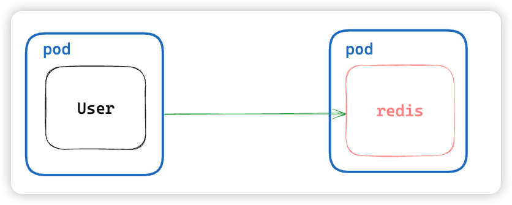
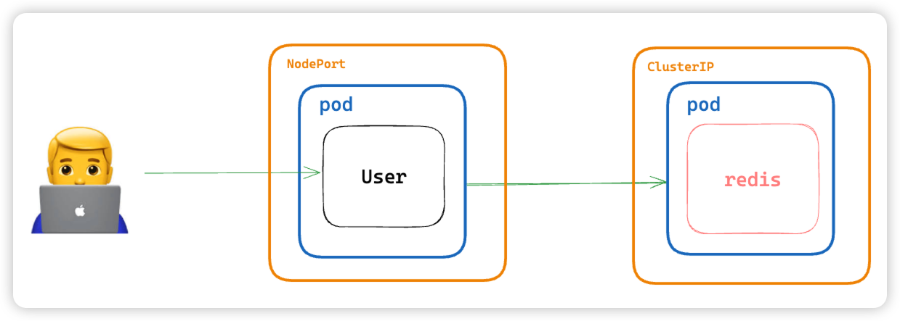
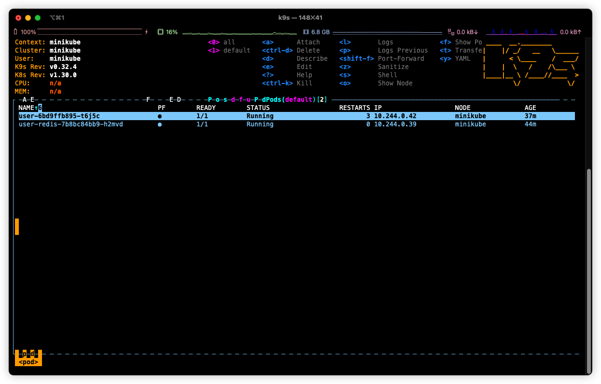

# BOAZ 쿠버네티스 실습

빅데이터 커뮤니티인 BOAZ에서 진행한 쿠버네티스 실습 자료입니다.

- `Table of Contents`
    - 실습 내용
    - minikube 설치
    - minikube 실행
    - 실습 코드
    - TIP
    - Autoscaling
    - Service
        - without ClusterIP
        - With ClusterIP
        - With NodePort
    - k9s
    - 이 다음은?

## 실습 내용

1. autoscaling with deployment
2. service for exposing pod
    1. clusterIP
    2. NodePort

## minikube 설치

> 💡 [https://minikube.sigs.k8s.io/docs/start/](https://minikube.sigs.k8s.io/docs/start/)
>
> 위 링크 들어가서 환경에 맞는 minikube 설치하기

```bash
# brew를 쓰고 있다면
brew install minikube
```

## minikube 실행

- 실행이 안된다면 로그를 잘 읽어보고 docker daemon이 실행되어 있는지 확인해주세요!

```bash
minikube start
```

## 실습 코드

- [https://github.com/mokhs00/BOAZ-2024-k8s-practice](https://github.com/mokhs00/BOAZ-2024-k8s-practice)

```bash
git clone https://github.com/mokhs00/BOAZ-2024-k8s-practice.git
```

## TIP

`kubectl` 명령어 alias를 `k`로 설정해서 다음과 같은 명령어가 가능합니다.

이 실습에서는 편의를 위해 alias를 사용합니다.

```bash
kubectl apply ...

# alias 활용
k apply ...
```

## Autoscaling

deployment를 이용해서 autoscaling되는 과정을 살펴봅니다.

- `deployment-autoscaling/nginx-deployment.yaml`

    ```yaml
    apiVersion: apps/v1
    kind: Deployment
    metadata:
      name: nginx-deployment
      labels:
        app: nginx-deployment
    spec:
      replicas: 2 # pod가 2개 유지되도록
      selector:
        matchLabels:
          app: nginx-deployment
      template:
        metadata:
          labels:
            app: nginx-deployment
        spec:
          containers:
            - name: nginx
              image: nginx:1.14.2
              ports:
                - containerPort: 80
    
    ```

**kubernetes에 리소스 반영 요청**

```bash
# -f: 파일을 사용하겠다는 option
k apply -f deployment-autoscaling/nginx-deployment.yaml
```

**nginx pod이 2개 정상적으로 동작중인지 확인**

```bash
k get pods

:<<'OUTPUT'
NAME                                READY   STATUS    RESTARTS   AGE
nginx-deployment-7ff9df4745-g5tk5   1/1     Running   0          2m53s
nginx-deployment-7ff9df4745-nh25n   1/1     Running   0          2m53s
OUTPUT

```

**nginx pod 하나 delete해서 자동으로 pod이 복구되는지 확인**

```bash
# nginx-deployment-7ff9df4745-nh25n는 위에서 확인한 pod NAME
k delete pod nginx-deployment-7ff9df4745-nh25n
```

**delete 이후 pod 상태 확인**

```bash
k get pods

:<<'OUTPUT'
NAME                                READY   STATUS    RESTARTS   AGE
nginx-deployment-7ff9df4745-g5tk5   1/1     Running   0          6m6s
nginx-deployment-7ff9df4745-lmkm8   1/1     Running   0          4s 
OUTPUT

# ^nginx-deployment-7ff9df4745-lmkm8 pod이 새로 생기고 age가 4s로 갱신된 걸 확인 가능
```

**Clean resource**

리소스 정리하기는 필수!

```bash
k delete -f deployment-autoscaling/nginx-deployment.yaml
```

## Service

Service는 실제로 애플리케이션을 운영할 때 네트워크 설정을 담당하기 때문에 중요!

**여기서는 ClusterIP와 NodePort를 순차적으로 추가하면서 실습해봅니다.**

**user server application에서 redis를 사용하는 간단한 예시를 준비해봤어요.**



### without ClusterIP

**처음에는 redis에 clusterIP없이 진행해봅니다.**


> 💡 **user 서버는 redis에 통신이 실패하면 에러가 발생하도록 되어있으니 참고하세요!**


- `service/service-without-redis-clusterip.yaml`

    ```yaml
    apiVersion: apps/v1
    kind: Deployment
    metadata:
      name: user
      labels:
        app: user
    spec:
      selector:
        matchLabels:
          app: user
      template:
        metadata:
          labels:
            app: user
        spec:
          containers:
            - name: user
              image: mokhs00/boaz-k8s-sample-user
              ports:
                - containerPort: 8080
              env:
                - name: REDIS_HOST
                  value: "user-redis" # kubernetes internal DNS를 이용
                - name: REDIS_PORT
                  value: "6379"
    
    ---
    
    apiVersion: v1
    kind: Service
    metadata:
      name: user
      labels:
        app: user
    spec:
      selector:
        app: user
      ports:
        - port: 8080
          targetPort: 8080
          protocol: TCP
    
    ---
    
    apiVersion: apps/v1
    kind: Deployment
    metadata:
      name: user-redis
      labels:
        app: user
    spec:
      selector:
        matchLabels:
          app: user-redis
      template:
        metadata:
          labels:
            app: user-redis
        spec:
          containers:
            - name: user-redis
              image: redis
              ports:
                - containerPort: 6379
                  protocol: TCP
    
    ```

**kubernetes에 리소스 반영**

```bash
k apply -f service/service-without-redis-clusterip.yaml
```

**리소스 확인**

```bash
k get pods

:<< 'OUTPUT'
NAME                          READY   STATUS             RESTARTS      AGE
user-68f6c446b4-z4hk8         0/1     CrashLoopBackOff   3 (17s ago)   75s
user-redis-7b8bc84bb9-h2mvd   1/1     Running            0             2m40s
OUTPUT

# ^user pod이 CrashLoopBackOff status로 에러 발생
```

**user pod에 redis 통신 실패 시 남기는 log를 확인해보자**

- `golang 서버 코드 중 일부`

    ```go
    package main
    
    import (
      // ...
    )
    
    func main() {
    	// ...
    	var (
    		redisHost = os.Getenv("REDIS_HOST")
    		redisPort = os.Getenv("REDIS_PORT")
    	)
    
    	redisClient := redis.NewClient(
    		&redis.Options{
    			Addr: fmt.Sprintf("%s:%s", redisHost, redisPort),
    		},
    	)
    
    	ctx, cancelFunc := context.WithTimeout(context.Background(), 3*time.Second)
    	defer cancelFunc()
    	if err := redisClient.Ping(ctx).Err(); err != nil {
    		// connection 실패 시 에러 응답과 함께 서버 종료
    		e.Logger.Fatalf("failed to connect to redis: %v", err)
    	}
    
    	// ...
    }
    ```

```bash
# user pod name을 확인하고 해당 pod의 로그 확인
k logs user-68f6c446b4-z4hk8

:<< 'OUTPUT'
{"time":"2024-05-15T07:49:22.80621397Z","level":"FATAL","prefix":"echo","file":"main.go","line":"30","message":"failed to connect to redis: dial tcp: lookup user-redis on 10.96.0.10:53: no such host"}
...
OUTPUT

# ^kubernetes internal DNS에서 user-redis가 확인되지 않아 실패한 걸로 확인
```

### With ClusterIP

**이제 clusterIP를 사용해서 user server에서 redis에 통신이 가능하도록 수정해봅니다.**


- `service/service-redis-clusterip.yaml`

    ```yaml
    apiVersion: apps/v1
    kind: Deployment
    metadata:
      name: user
      labels:
        app: user
    spec:
      selector:
        matchLabels:
          app: user
      template:
        metadata:
          labels:
            app: user
        spec:
          containers:
            - name: user
              image: mokhs00/boaz-k8s-sample-user
              ports:
                - containerPort: 8080
              env:
                - name: REDIS_HOST
                  value: "user-redis" # kubernetes internal DNS를 이용
                - name: REDIS_PORT
                  value: "6379"
    
    ---
    
    apiVersion: v1
    kind: Service
    metadata:
      name: user
      labels:
        app: user
    spec:
      selector:
        app: user
      ports:
        - port: 8080
          targetPort: 8080
          protocol: TCP
    
    ---
    
    apiVersion: apps/v1
    kind: Deployment
    metadata:
      name: user-redis
      labels:
        app: user
    spec:
      selector:
        matchLabels:
          app: user-redis
      template:
        metadata:
          labels:
            app: user-redis
        spec:
          containers:
            - name: user-redis
              image: redis
              ports:
                - containerPort: 6379
                  protocol: TCP
    
    ---
    
    apiVersion: v1
    kind: Service
    metadata:
      name: user-redis
      labels:
        app: user
    spec:
      ports:
        - port: 6379
          targetPort: 6379
          protocol: TCP
      selector:
        app: user-redis
    
    ```

**kubenetes 리소스에 반영**

```bash
k apply -f service/service-redis-clusterip.yaml 
```

**service 반영 확인**

```bash
k get service

:<< 'OUTPUT'
NAME         TYPE        CLUSTER-IP       EXTERNAL-IP   PORT(S)    AGE
kubernetes   ClusterIP   10.96.0.1        <none>        443/TCP    3d12h
user         ClusterIP   10.108.240.169   <none>        8080/TCP   20m
user-redis   ClusterIP   10.109.207.64    <none>        6379/TCP   46s
OUTPUT

# ^ user-redis ClusterIP가 추가됨

```

**user deployment에 restart 명령**

```bash
k rollout restart deployment user
```

**리소스 재확인**

ClusterIP를 추가해줘서 연결이 잘 되는 걸 확인해보자

> 💡 **k get pods를 rollout이 진행되는 중간에 호출하면 rollout 과정을 볼 수 있습니다!**

```bash
k get pods

:<< 'OUTPUT'
NAME                          READY   STATUS    RESTARTS      AGE                                                    
user-6bd9ffb895-t6j5c         1/1     Running   3 (70s ago)   95s
user-redis-7b8bc84bb9-h2mvd   1/1     Running   0             8m21s
OUTPUT

# ^status가 Running인 걸 보면 정상으로 확인

# 로그도 확인해보면 정상적으로 서버가 동작하는 걸로 보임
k logs user-6bd9ffb895-t6j5c

:<< 'OUTPUT'
   ____    __
  / __/___/ /  ___
 / _// __/ _ \/ _ \
/___/\__/_//_/\___/ v4.12.0
High performance, minimalist Go web framework
https://echo.labstack.com
____________________________________O/_______
                                    O\
⇨ http server started on [::]:8080
OUTPUT

```

### With NodePort


**현재 user pod에 접근하고 싶어도 user pod에는 Service가 없기 때문에 접근이 불가능합니다.**



**그래서 이렇게 pod를 외부에 노출해주는 NodePort를 추가해서 접근이 가능하도록 해보겠습니다!**

> 💡 사실 minikube에서는 통신 가능 여부를 쉽게 테스트할 수 있도록 util을 지원합니다.
>
> 이건 밑에서 알아볼게요!

- `service/service-user-nodeport.yaml`

    ```yaml
    apiVersion: apps/v1
    kind: Deployment
    metadata:
      name: user
      labels:
        app: user
    spec:
      selector:
        matchLabels:
          app: user
      template:
        metadata:
          labels:
            app: user
        spec:
          containers:
            - name: user
              image: mokhs00/boaz-k8s-sample-user
              ports:
                - containerPort: 8080
              env:
                - name: REDIS_HOST
                  value: "user-redis" # kubernetes internal DNS를 이용
                - name: REDIS_PORT
                  value: "6379"
    
    ---
    
    apiVersion: v1
    kind: Service
    metadata:
      name: user
      labels:
        app: user
    spec:
      type: NodePort
      selector:
        app: user
      ports:
        - port: 8080
          targetPort: 8080
          nodePort: 30080 # 30080 port로 접근할 수 있도록 nodePort open
          protocol: TCP
    
    ---
    
    apiVersion: apps/v1
    kind: Deployment
    metadata:
      name: user-redis
      labels:
        app: user
    spec:
      selector:
        matchLabels:
          app: user-redis
      template:
        metadata:
          labels:
            app: user-redis
        spec:
          containers:
            - name: user-redis
              image: redis
              ports:
                - containerPort: 6379
                  protocol: TCP
    
    ---
    
    apiVersion: v1
    kind: Service
    metadata:
      name: user-redis
      labels:
        app: user
    spec:
      ports:
        - port: 6379
          targetPort: 6379
          protocol: TCP
      selector:
        app: user-redis
    
    ```

**kubernetes에 리소스 반영**

```bash
k apply -f service/service-user-nodeport.yaml
```

**service 리소스 확인**

```bash
k get service

:<< 'OUTPUT'
NAME         TYPE        CLUSTER-IP     EXTERNAL-IP   PORT(S)          AGE                                            
kubernetes   ClusterIP   10.96.0.1      <none>        443/TCP          3d12h
user         NodePort    10.108.9.33    <none>        8080:30080/TCP   19m
user-redis   ClusterIP   10.102.10.49   <none>        63
OUTPUT

# user NodePort가 생성됨
```

**user service에 접근해보자**

**minikube service 명령을 이용해서 터널링해서 user service에 접근해봅시다!**

```bash
minikube service user

:<< 'OUTPUT'
|-----------|------|-------------|---------------------------|
| NAMESPACE | NAME | TARGET PORT |            URL            |
|-----------|------|-------------|---------------------------|
| default   | user |        8080 | http://192.168.49.2:30080 |
|-----------|------|-------------|---------------------------|
🏃  user 서비스의 터널을 시작하는 중
|-----------|------|-------------|------------------------|
| NAMESPACE | NAME | TARGET PORT |          URL           |
|-----------|------|-------------|------------------------|
| default   | user |             | http://127.0.0.1:53314 |
|-----------|------|-------------|------------------------|
🎉  Opening service default/user in default browser...
❗  darwin 에서 Docker 드라이버를 사용하고 있기 때문에, 터미널을 열어야 실행할 수 있습니다
OUTPUT
```

> 💡 아래 OUTPUT에서도 잘 설명이 되어 있지만,
>
> minikube의 driver가 docker일 경우 클러스터의 ip에 직접 접근 불가능하고 터널링을 통해서 우회해야 합니다.
> 


**이제 URL에 접근해서 응답이 잘 나오는지 확인해봅시다**

위에서 나온 URL로 접근하면 응답이 잘 나오는 걸 볼 수 있습니다

e.g. [http://127.0.0.1:53314/](http://127.0.0.1:53314/)


> 💡 user server에는 API를 몇 개 추가해두었어요!
> 아래 API들에도 잘 접근되는지 확인해봅시다
>
> `/users/:user-id`
> → 유저 정보 조회 (user-id 값을 변경해보세요!)
>
> `/count`
> → Redis의 INCR 명령어를 사용해서 접근할 때마다 증가하는 카운터를 확인할 수 있어요.
>
> 아래에서 API 구현 코드를 살펴볼 수 있습니다.


- get_user.go

    ```go
    // ...
    
    type GetUserResponse struct {
    	User *model.User `json:"user,omitempty"`
    }
    
    func GetUserHandler(c echo.Context) error {
    	// User ID from path `users/:id`
    	userIDStr := c.Param("id")
    
    	userID, err := strconv.ParseInt(userIDStr, 10, 64)
    	if err != nil {
    		return c.JSON(http.StatusBadRequest, &response.ErrorResponse{
    			Message: "invalid user id",
    		})
    
    	}
    
    	user := getUserByID(userID)
    	if user == nil {
    		return c.JSON(http.StatusNotFound, &response.ErrorResponse{
    			Message: "user not found",
    		})
    
    	}
    
    	return c.JSON(http.StatusOK, &GetUserResponse{
    		User: user,
    	})
    }
    
    func getUserByID(userID int64) *model.User {
    	users := []*model.User{
    		{1, "Alice"},
    		{2, "Bob"},
    		{3, "Charlie"},
    		{4, "David"},
    		{5, "Eve"},
    	}
    
    	userById := make(map[int64]*model.User, len(users))
    	for _, user := range users {
    		userById[user.ID] = user
    	}
    
    	return userById[userID]
    }
    
    ```

- get_count.go

    ```go
    // ...
    type GetCountResponse struct {
    	Count int64 `json:"count"`
    }
    
    func GetCountHandler(c echo.Context, redisClient *redis.Client) error {
    	ctx := c.Request().Context()
    
    	count := redisClient.Incr(ctx, "count")
    	if count.Err() != nil {
    		return c.JSON(500, &response.ErrorResponse{
    			Message: fmt.Sprintf("internal server error: '%s'", count.Err()),
    		})
    	}
    
    	return c.JSON(200, &GetCountResponse{
    		Count: count.Val(),
    	})
    }
    ```

## k9s

**kubectl GUI tool을 하나 소개하려고 해요 ㅎㅎ**

CLI로 조작하던 명령들을 GUI로 좀 더 빠르고 간편하게 사용할 수 있어요.

> 💡 brew에 등록되어 있어서 편하게 설치 가능하고 저도 애용하는 툴입니다!



## 이 다음은?

kubernetes는 네트워크 집합체라고도 볼 수 있고 오늘은 한정된 시간으로 다루지 못한 내용들이 훨씬 많아요.

필요하거나 궁금한 부분들이 생기면 공식문서를 참고해보시는 걸 추천합니다!
